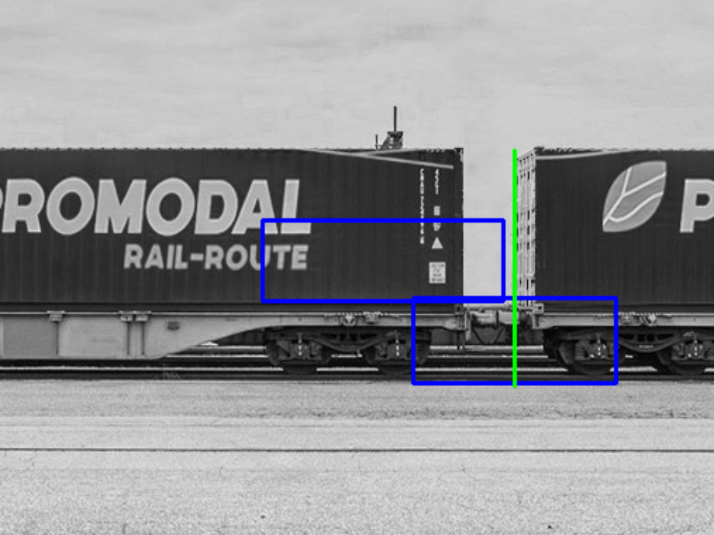

# Coupler detector
## Problem statement
`<redacted>`

## Problem description
Trains are composed of an engine/locomotive and train "cars" joined by a disconnectable joint called coupler or a coupling. The purpose of this computer vision model is to detect these couplers from the image as viewed by a camera mounted on a pole next to a railway track. The usecase is not stated but the output is supposed to be _x_ coordinate. Evaluting metric is stated as "accuracy".

### Observations
- very small dataset (100)
    - Images from very few locations, ligting conditions, etc.
    - more types of coupler (coupler between bogies, on-bogie-coupler - unsure of terminology)
- multiple overlapping trains on multi-tracks
- the axis of the camera doesn't need to be perpendicular to the tracks
- camera can be in a place where there is a bend in the tracks.
- it might be crucial that the model is resilient against different types of weather and ligting conditions (eg. lighting angle change, night).
- looks like north-american railway system
- output format doesn't allow multiple couplings in image

### Improvements
 - not common dataset format (eg. COCO's labels.json)
 - missing image file
 - crooked 4-point polygons instead of standard bounding box format
 - large/inaccurate annotations encompasing more than coupling (sorrounding bogies)

### TODOs
 - use a metric (maybe mAP)
 - 1 channel model for B/W
 - augumentations (albumentations)
 - dropout

# Usage
## Install
Poetry: `poetry install`, `poetry shell`  
pip: `pip install -r requirements`, `pip install -e .`

## Train 
 - extract dataset to `car_coupling_train`
 - `python ./coupler_detector/train.py` (~5 CPU-core-minutes)

## Test
test random file:
`./coupler_detector/find_couplings $(ls -1 car_coupling_train/*.jp*|sort -R|head -1) --preview`

To get validation set image paths:
`python ./coupler_detector/dataset.py`

## Preview

\
Edited example image by: [Florent Dellesale](https://commons.wikimedia.org/wiki/File:Train_PROMODAL.jpg)
